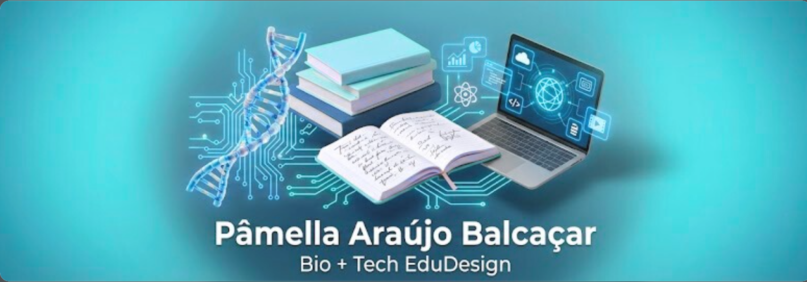
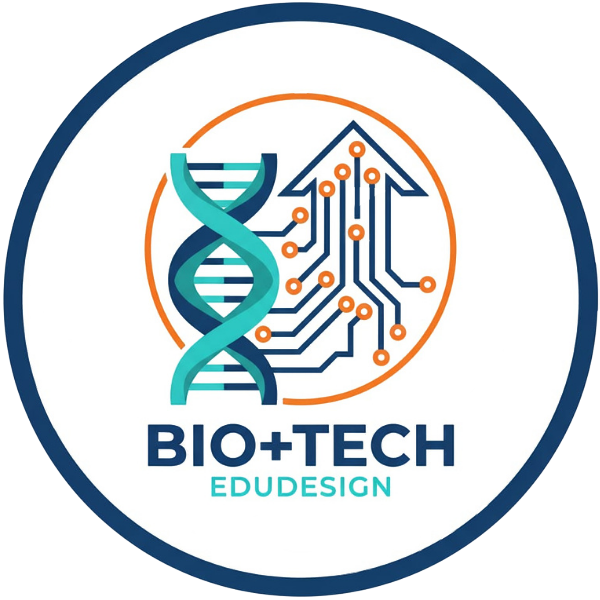

---

# Sobre a marca 

  

  
A marca **Bio+Tech EduDesign** nasceu na interseção entre biologia, computação, tecnologia educacional, ciência de dados e biotecnologia. Sendo bióloga, tecnóloga em informática, especialista em Educação Digital e Biotecnologia, com mais de 14 anos de experiência em educação pública nos níveis: ensino médio, técnico profissionalizante superior; com adoção de prática inovadoras e metodologias ativas. Ainda apresenta uma trajetória  percorrida em grupo de pesquisa em Ambientes Virtuais e Inteligentes (UERJ), comunidades open source como PyLadies Brasil, produção de tutoriais técnicos e criação de recursos educacionais abertos (REA). No momento, tem atuação como Tutora de Tecnologia Educacional na UFMT-UAB e como criadora no Canva e Notion, unindo rigor pedagógico, design instrucional gamificado, metodologia ativas de aprendizagem e estética acessível.

  

## ⏳ De onde viemos: 

Um laboratório de ideias que começou com tutoriais de Python e Biopython, passou por hackathons, templates Notion para estudantes universitários e agora se expande para o universo visual do Canva.

  

## 🎯 Para onde vamos: 

  

Consolidar uma biblioteca de recursos educacionais visuais, digitais e/ou abertos que democratizem o acesso ao conhecimento em Ciências Biológicas, Ciência de dados, IA, biotecnologia, inovação pedagógico e metodologias ativas, sempre com foco em inclusão, acessibilidade e autonomia docente.

|🚀 **Nossa missão** | 💡 **Nossa visão** |
|:---:|:---:|
| Transformar temas complexos de ciência, tecnologia e educação digital em recursos visuais prontos para uso, pedagogicamente sólidos e esteticamente acolhedores, capacitando educadores e estudantes a criarem, adaptarem e ensinarem com autonomia e confiança. | Construir um ecossistema de aprendizado visual e colaborativo onde professores, estudantes e criadores de conteúdo educacional de todo o Brasil e América Latina se sintam empoderados para experimentar, inovar e compartilhar conhecimento com leveza, rigor e criatividade. |
 
  

---

### 📖 Logotipo da marca

  

  
  

  
* **Forma:** apresenta uma composição isométrica 3D centralizada. A estrutura visual é construída em camadas verticais: a base sólida é representada pelo livro físico, que serve de alicerce para a estrutura helicoidal (DNA) que o envolve e atravessa, culminando numa interface digital holográfica que flutua no topo. A tipografia sustenta a imagem, criando um bloco visual equilibrado e estável.

* **Símbolo:** Cada elemento foi escolhido para narrar a trajetória multidisciplinar:

 - O Livro (A Base): Representa o Design Educacional e a Pedagogia. É o fundamento de todo o teu trabalho — o conhecimento teórico e a estrutura de aprendizagem que sustenta a tecnologia.
 - A Hélice de DNA (A Conexão): Representa a tua formação em Biologia e Ciências. Ela não está apenas ao lado, ela envolve o livro, simbolizando como a tua visão científica permeia todo o teu método de ensino. A estrutura em azul brilhante sugere a modernização da biologia tradicional.
 - A Tela Holográfica/Interface (O Topo): Representa a Tecnologia e Inovação. É a "camada final" que entregas ao aluno: o conteúdo tradicional transformado em experiência digital, interativa e visual.
 - A Integração: O facto de os elementos estarem sobrepostos mostra que para ti estas áreas não estão separadas; elas funcionam como um sistema único.

* **Estilo:** A estética adota o estilo "Soft Tech" ou "Clean Modernism".

* **Paleta de Cores:** O uso predominante de gradientes de turquesa (Teal) e ciano transmite, simultaneamente, a tranquilidade/natureza (Bio) e a eletricidade/inovação (Tech). É uma cor que inspira confiança e clareza mental.
Renderização: O acabamento "glossy" (brilhante) e translúcido, com iluminação suave e sombras difusas, confere um ar futurista e sofisticado. Foge do visual "clínico" ou "frio" da tecnologia antiga, apresentando uma tecnologia mais humana e acessível.
Tipografia: Uma fonte sans-serif branca, ousada e legível, que oferece contraste e legibilidade imediata, reforçando o profissionalismo.

Variação:

---

### 📖 Sobre o Projeto **Pré-ENEM Digital MT**

O **Pré-ENEM Digital MT** é uma iniciativa educacional do **Secretaria de Estado de Educação de Mato Grosso** (SEDUC-MT) voltada à preparação de estudantes da rede pública para o Exame Nacional do Ensino Médio (ENEM) ou vestibulares.

Alguns materiais foram concebido pela marca **Bio+Tech EduDesign**, com desenvolvimento autoral aplicando **metodologias ativas de aprendizagem** — **Aprendizagem Baseada em Problemas (ABP)** combinada com **Gamificação** — para transformar o estudo de química em uma jornada imersiva, representativa e inspiradora.

---

Biblioteca de OAD utilizado no **Pré-ENEM Digital MT** - polo Rondonópolis:

Esta é a coleção de uma série de aulas interativas de Química, aplicando metodologias ativas de aprendizagem e tecnologias digitais de informação e comunicação (TDIC):

1. [Estudo das Soluções](https://github.com/bio-tech-edu/solucoes)
2. [Termoquímica](https://github.com/bio-tech-edu/termoquimica)
3. [Cinética Química](https://github.com/bio-tech-edu/cinetica)
4. [Equilíbrio Química](https://github.com/bio-tech-edu/equilibrio)

---

